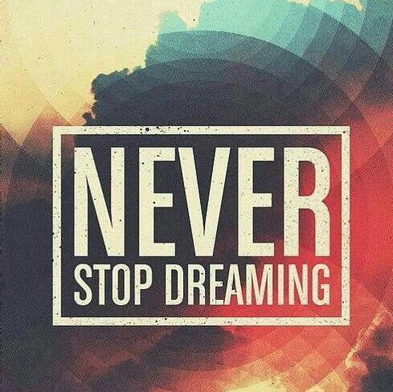

##瓦尔登湖畔一棵松（Suvllian)
###通过做一些简单有趣的页面在这里记录生活
站点地址：http://suvllian.github.io/
***
  
  
###Page1(2016-11-12):[记录去过的城市](http://suvllian.github.io/)
>今年去过的城市：北京、天津、青岛、重庆、成都。  
每个城市选择一张照片，用before和after伪类给每张图片添加简介。  
用CSS3实现常见的动画效果。  

###Page2(2016-11-19):[一个简历页面](http://suvllian.github.io/page2/index.html)  
>参考了网络上的一些简历设计，做了一个简历页面。  
同样是使用了before和after伪类元素，学习了利用content属性添加图标。  
熟悉了HTML语义化标签的编写。
